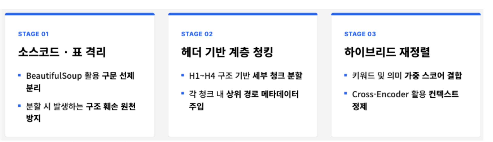
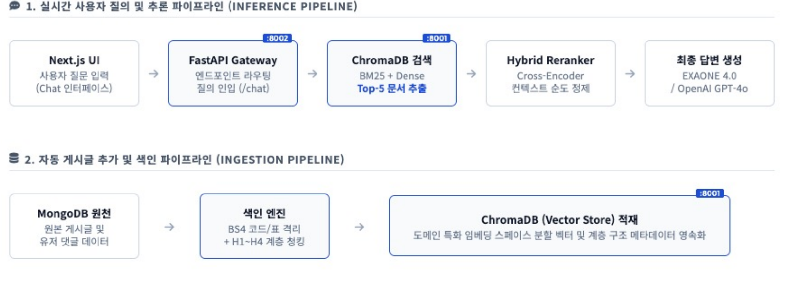
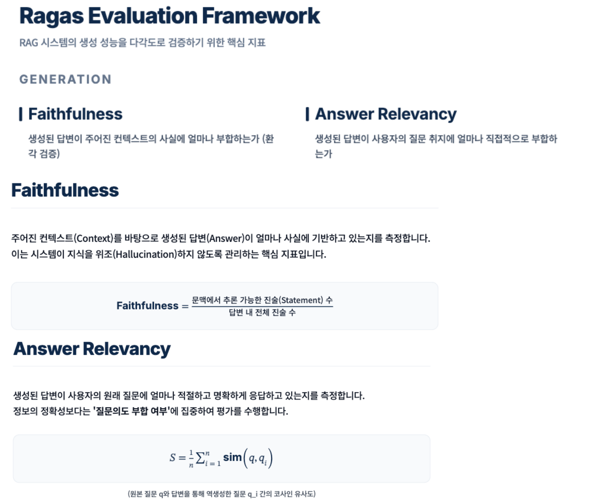
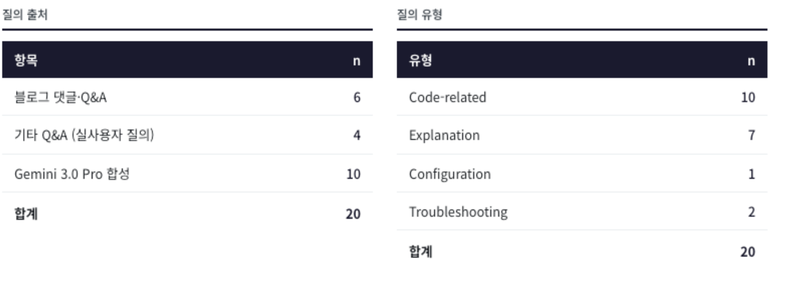
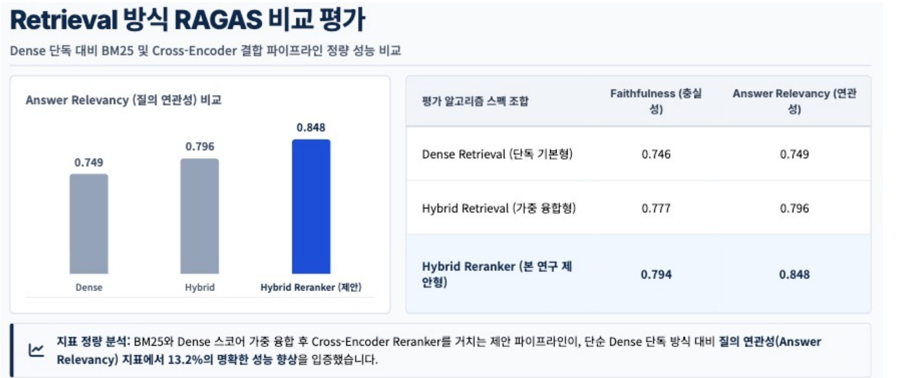
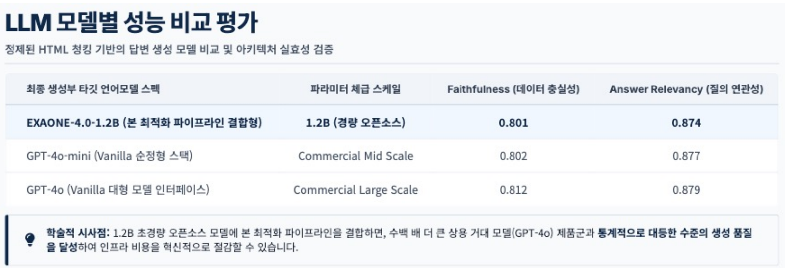

<div align="center">

**日本語** | [한국어](README.ko.md)

# RagBlog

**HTML構造を考慮した階層的チャンキング + ハイブリッド検索に基づく韓国語技術ブログRAGチャットボット**

_Optimizing Korean Tech RAG Performance via HTML-Aware Hierarchical Chunking and Hybrid Search_

ブログに記事を投稿すると自動でインデックスされ、読者は記事を読みながらその場で質問できる**RAG内蔵型技術ブログ**です。
コードブロック・表・見出し構造を保持する前処理と、BM25 + Dense + Cross-Encoder再ランキングのパイプラインにより、
**1.2Bの軽量オープンソースモデルだけでGPT-4oと同等の回答品質**を達成しました。

📄 [論文 (paper.pdf)](docs/paper.pdf) · 🖼️ [ポスター (poster.pdf)](docs/poster.pdf)

</div>

---

## 目次

1. [プロジェクト概要](#1-プロジェクト概要)
2. [課題定義](#2-課題定義)
3. [システムアーキテクチャ](#3-システムアーキテクチャ)
4. [コア設計](#4-コア設計)
5. [評価フレームワーク](#5-評価フレームワーク-ragas-evaluation-framework)
6. [実験結果](#6-実験結果)
7. [技術スタック](#7-技術スタック)
8. [プロジェクト構成](#8-プロジェクト構成)
9. [実行方法](#9-実行方法)

---

## 1. プロジェクト概要

| 項目 | 内容 |
|---|---|
| **主な成果** | Answer Relevancy **0.749 → 0.848 (+13.2%)**、Faithfulness **0.747 → 0.851**（RAGAS） |
| **デモ** | 記事375件 → チャンク3,217件をインデックス、記事詳細ページ内でリアルタイムQ&Aチャットボット |

### なぜ作ったのか

技術ブログは企業や開発者の**知識資産**ですが、検索パラダイムがSEOから**GEO（Generative Engine Optimization）**へ移行するにつれ、「AIが引用しやすい構造化されたコンテンツ」の価値が急速に高まっています（AIエンジン経由の流入トラフィック 前年比 +4,700%、Adobe Digital Insights）。

しかし既存のRAG手法を韓国語の技術ブログにそのまま適用すると、**コードブロックが途中で切れ、表が崩れて**回答の信頼性が低下します。本プロジェクトはこの問題を**前処理の段階で**解決し、新しい記事が投稿されるたびに**自動でインデックスされる**実サービス志向のパイプラインを構築しました。

---

## 2. 課題定義

| 既存手法の限界 | 本プロジェクトのアプローチ |
|---|---|
| `RecursiveCharacterTextSplitter` による単純分割 → `<pre>`、`<table>` の途中で切れて文脈が破壊される | **特殊ブロック（コード・表）を先に分離**し、テキストのみを階層的にチャンキング |
| HtmlRAGなど最新研究は英語の一般Web文書が中心 | **韓国語技術ブログのドメイン**に特化した前処理 + 埋め込み/LLMの選定 |
| 固有名詞・技術用語（例: `@EnableJpaAuditing`）に対してDense検索が弱い | **BM25 + Dense の重み付き融合**の後に**Cross-Encoderで再ランキング** |
| 新しい記事が投稿されてもインデックスが更新されない | 記事保存時に**FastAPI `/index` へ即時インデックス**（自動化） |

---

## 3. システムアーキテクチャ

### 3.1 3段階の処理戦略



| Stage | 何を | なぜ |
|---|---|---|
| **01 ソースコード・表の分離** | BeautifulSoupで `<pre>`、`<table>` を本文から事前に分離 | 分割の過程でコード/表が切れて構造が壊れることを根本から防止 |
| **02 見出しベースの階層チャンキング** | H1〜H4の構造で1次分割した後、400文字単位で2次分割し、各チャンクに上位パス（`section_path`）メタデータを付与 | 文脈の断絶を防ぎ、検索結果が文書内のどこに位置するかをLLMが認識できる |
| **03 ハイブリッド再ランキング** | キーワード（BM25）と意味（Dense）の重み付きスコアを結合 → Cross-Encoderでコンテキストを精製 | 技術用語の正確なマッチングと意味的類似度を相互補完し、最終Top-Kの純度を確保 |

### 3.2 2つのパイプライン



**① 推論パイプライン（Inference）** — ユーザーが記事を読みながら質問すると、リアルタイムで回答します。

| 段階 | コンポーネント | ポート | 役割 |
|---|---|:---:|---|
| 1 | Next.js Chat UI | 3000 | 記事詳細ページ内のチャットインターフェース、質問入力 |
| 2 | FastAPI Gateway | 8002 | `POST /chat` — `post_id` の有無に応じて記事単位 / 全体検索に分岐 |
| 3 | ChromaDB 検索 | 8001 | Dense(Top-8) + BM25(Top-12) のハイブリッド検索 |
| 4 | Hybrid Reranker | — | `mxbai-rerank-large-v1` Cross-EncoderでTop-4に精製 |
| 5 | 回答生成 | — | EXAONE-4.0-1.2B（デフォルト）または OpenAI GPT-4o |

**② インデックスパイプライン（Ingestion）** — 記事が保存されると、ユーザーへの応答をブロックせずにバックグラウンドでインデックスします。

| 段階 | コンポーネント | 役割 |
|---|---|---|
| 1 | MongoDB（ソース） | 元の記事（HTML）およびユーザーコメントデータ |
| 2 | インデックスエンジン（`/index`） | BS4によるコード/表の分離 + H1〜H4階層チャンキング + チャンクごとのメタデータ（`post_id`、`chunk_type`、`section_path`、`summary`）付与 |
| 3 | ChromaDB 格納 | `mxbai-embed-large-v1` の埋め込みベクトルと階層構造メタデータを永続化、BM25インデックスも同時に更新 |

### 3.3 ランタイム構成

- **Next.js (3000)** — ブログUI、記事CRUD、NextAuth認証、記事詳細ページ内のチャットボットコンポーネント
- **FastAPI (8002)** — `/index`（インデックス）、`/chat`（RAG応答）。LLM・埋め込み・リランカーをプロセス内に常駐ロード
- **ChromaDB (8001)** — HTTPサーバーモードで分離運用、再起動後もインデックスを保持
- **MongoDB** — 記事/コメントの原本、NextAuthセッションアダプター

---

## 4. コア設計

### 4.1 HTML構造に基づく階層的チャンキング

```
HTML原文
 ├─ [1] BeautifulSoup: 不要タグの除去 + <pre>/<table> ブロックの分離 → chunk_type = code | table
 ├─ [2] HTMLHeaderTextSplitter: h1〜h4見出しを基準に1次分割 → section_path メタデータを付与
 └─ [3] RecursiveCharacterTextSplitter: 400文字 / オーバーラップ100文字で2次分割
         └─ 各チャンクに post_id · chunk_type · section_path · summary メタデータを注入
```

- コード/表は**1つのチャンクとして丸ごと保持** → 「サンプルコードを見せて」といった質問で途中で切れたコードが返らない
- `section_path`（例: `H2: JPA Auditing > H3: BaseTimeEntity`）をコンテキストと一緒に注入し、LLMが**文書内の位置を認識**
- チャンクサイズは 200/400/800 文字で実験した結果、**400文字**が文脈保持と精度のバランス点

### 4.2 ハイブリッド検索 + Cross-Encoder 再ランキング

| 段階 | 実装 | 役割 |
|---|---|---|
| Dense | `mixedbread-ai/mxbai-embed-large-v1` + ChromaDB | 意味的類似度 |
| Sparse | BM25（インメモリ、インデックス時に更新） | 技術用語・固有名詞の正確なマッチング |
| 融合 | `0.65 × Dense + 0.35 × BM25`（0.5〜0.7の範囲でチューニング） | 相互補完 |
| 再ランキング | `mixedbread-ai/mxbai-rerank-large-v1` Cross-Encoder | 最終Top-4に精製 |

### 4.3 自動化されたインデックスパイプライン

`pages/api/post/new.js` でMongoDBへの保存直後に**非同期で `/index` を呼び出し**、ユーザーへの応答をブロックせずにインデックスします。`/index` はChromaDBへの格納後にBM25インデックスも併せて更新するため、新しい記事が**即座にハイブリッド検索に反映**されます。

### 4.4 クエリ範囲の分岐とフォールバック

`/chat` は `post_id` があればその記事の範囲内で、なければ（グローバルチャット）コレクション全体から検索します。検索結果が空の場合（インデックスなし・マッチなし）は一般対話モードにフォールバックし、サービスが途切れないようにしました。

---

## 5. 評価フレームワーク（RAGAS Evaluation Framework）

RAGシステムの生成品質を多角的に検証するため、**RAGAS**のGeneration指標2つを主要指標として使用しました。



| 指標 | 測定対象 | 計算方法 | 意味 |
|---|---|---|---|
| **Faithfulness** | 回答が与えられたコンテキストの事実に合致しているか | 回答内の全ステートメント数に対する、文脈から推論可能なステートメント数の割合 | **ハルシネーションの抑制** — システムが知識を捏造していないか |
| **Answer Relevancy** | 回答がユーザーの質問の趣旨に直接的に合致しているか | 回答から逆生成した質問 q_i と元の質問 q のコサイン類似度の平均 | **質問意図への合致** — 情報の正確さよりも「聞かれたことに答えているか」 |

### 5.1 評価データセットの構成

実際のユーザー意図が含まれるコメント・Q&Aデータを優先的に反映し、多様性を確保するためにGemini 3.0 Proで合成クエリを併せて生成した後、研究者が直接検収して最終**20問**を確定しました。



- **クエリの出典**: ブログコメント・Q&A 6 · その他の実ユーザークエリ 4 · Gemini 3.0 Pro 合成 10
- **クエリの種類**: Code-related 10 · Explanation 7 · Troubleshooting 2 · Configuration 1
- **コーパス**: プログラミング系技術ブログ記事 375件 → 3,217チャンク
- 評価セットは `modelBackend/model/evaluation/golden_references.json`、実行は `run_ragas*.py` で再現可能

---

## 6. 実験結果

### 6.1 Retrieval方式の比較 — ハイブリッド + リランカーの効果

Dense単独 → BM25重み付き融合 → Cross-Encoder再ランキングの順に検索戦略を段階的に適用し、RAGASスコアを比較しました。



| Retrieval | Faithfulness | Answer Relevancy |
|---|:---:|:---:|
| Dense Retrieval（単独・ベースライン） | 0.746 | 0.749 |
| Hybrid Retrieval（重み付き融合） | 0.777 | 0.796 |
| **Hybrid Reranker（本研究の提案手法）** | **0.794** | **0.848** |

> BM25とDenseのスコアを重み付き融合した後にCross-Encoder Rerankerを通す提案パイプラインは、Dense単独方式と比較して**Answer Relevancy +13.2%**という明確な性能向上を実証しました。

### 6.2 LLMモデル別の性能比較 — 軽量モデルで商用級の品質

精製されたHTMLチャンキングベースのパイプラインを固定したまま、最終生成部のLLMのみを差し替えてアーキテクチャの実効性を検証しました。



| 最終生成LLM | パラメータ規模 | Faithfulness | Answer Relevancy |
|---|---|:---:|:---:|
| **EXAONE-4.0-1.2B（本最適化パイプライン結合）** | **1.2B · 軽量オープンソース** | **0.801** | **0.874** |
| GPT-4o-mini（Vanilla） | Commercial Mid Scale | 0.802 | 0.877 |
| GPT-4o（Vanilla） | Commercial Large Scale | 0.812 | 0.879 |

> **学術的示唆** — 1.2Bの超軽量オープンソースモデルに本最適化パイプラインを組み合わせることで、数百倍大きい商用巨大モデル（GPT-4o）と**統計的に同等の生成品質**を達成し、インフラコストを大幅に削減できます。

### 6.3 チャンキング戦略の比較

| チャンキング戦略 | Faithfulness | Answer Relevancy |
|---|:---:|:---:|
| 単純分割（Baseline、RecursiveCharacterTextSplitter） | 0.832 | 0.843 |
| **HTML階層的チャンキング（Proposed）** | **0.852** | **0.848** |

### 6.4 埋め込みモデルの比較

| モデル | Faithfulness | Answer Relevancy |
|---|:---:|:---:|
| BGE-M3 | 0.849 | 0.846 |
| nomic-embed-text | 0.834 | 0.847 |
| **mxbai-embed-large-v1（採用）** | **0.851** | 0.844 |

### 6.5 ハイパーパラメータ探索

| パラメータ | 探索範囲 | 採用値 | 根拠 |
|---|---|---|---|
| チャンクサイズ | 200 / 400 / 800文字 | **400（オーバーラップ100）** | 200は文脈の損失、800は精度の低下 |
| ハイブリッド重み | Dense 0.5〜0.7 | **0.65 / 0.35** | 最高のRAGASスコア |
| Top-K | Dense 8 · BM25 12 → 最終 4 | — | リランカー入力の十分性とコンテキスト長のバランス |

---

## 7. 技術スタック

| 領域 | 技術 |
|---|---|
| **Frontend** | Next.js 14（App Router + Pages API）、React 18、Tailwind CSS 4、react-markdown、react-syntax-highlighter |
| **Auth / DB** | NextAuth 4 + MongoDB Adapter、MongoDB、AWS S3（画像アップロード） |
| **RAG Backend** | Python、FastAPI、LangChain、BeautifulSoup4 |
| **Vector / Search** | ChromaDB（HTTP server）、BM25、`mxbai-embed-large-v1`、`mxbai-rerank-large-v1` |
| **LLM** | `LGAI-EXAONE/EXAONE-4.0-1.2B`（HuggingFace Transformers、bf16）、OpenAI GPT-4o（比較群） |
| **Evaluation** | RAGAS、Gemini 3.0 Pro（合成クエリ生成） |

---

## 8. プロジェクト構成

```
RagBlog/
├── app/                          # Next.js App Router
│   ├── components/
│   │   ├── chat/                 #   Chat.js · GlobalChat.js — RAGチャットボットUI
│   │   ├── home/                 #   RagLanding · RecentPosts
│   │   └── auth/                 #   ログイン/ログアウトボタン
│   ├── detail/[id]/              # 記事詳細 + コードレンダラー + コメント + チャットボット
│   ├── list/, write/, edit/      # 一覧 · 作成 · 編集
│   └── words/                    # 用語集
├── pages/api/                    # REST API（記事CRUD、コメント、画像）
│   └── post/new.js               #   保存後に FastAPI /index を自動呼び出し
├── modelBackend/model/           # Python RAGバックエンド
│   ├── chat_server.py            #   FastAPI: /index, /chat · チャンキング · LLMロード
│   ├── retrieval_utils.py        #   HybridRetriever · CrossEncoderReranker
│   ├── reindex_bge.py            #   埋め込み差し替え時の全体再インデックス
│   ├── html2word.py              #   HTML → 文書変換ユーティリティ
│   ├── evaluation/
│   │   ├── golden_references.json  # 評価セット（質問 · 正解 · カテゴリ）
│   │   ├── run_ragas.py            # RAGAS評価スクリプト
│   │   └── results/                # 評価結果JSON（gitignored）
│   └── requirements.txt
├── scripts/dev-all.sh            # Chroma → FastAPI → Next.js ワンクリック起動
└── docs/                         # 論文 · ポスター · README用図表（images/）
```

---

## 9. 実行方法

### 9.1 事前準備

```bash
# Node
npm install

# Python（3.10+ 推奨、GPUがなければCPU fp32に自動フォールバック）
python -m venv .venv && source .venv/bin/activate
pip install -r modelBackend/model/requirements.txt
```

### 9.2 環境変数

**ルートの `.env.local`**（Next.js）

```env
NEXT_PUBLIC_CHAT_API_URL=http://localhost:8002
ACCESS_KEY=...          # AWS S3
SECRET_KEY=...
BUCKET_NAME=...
```

**`modelBackend/model/.env`**（FastAPI）

```env
LLM_MODEL_ID=LGAI-EXAONE/EXAONE-4.0-1.2B
CHUNK_SIZE=400
CHUNK_OVERLAP=100
EMBEDDING_TOP_K=8
BM25_TOP_K=12
HYBRID_FINAL_K=4
OPENAI_API_KEY=...      # RAGAS評価 / GPT比較群を使用する場合
```

> `util/database.js`（MongoDB接続）と `pages/api/auth/[...nextauth].js`（NextAuth設定）はセキュリティ上の理由でリポジトリから除外されています。ローカルでそれぞれ `MONGODB_URI`、OAuthクライアント設定を追加して作成してください。

### 9.3 起動

```bash
# 一括起動（Chroma 8001 → FastAPI 8002 → Next.js 3000）
./scripts/dev-all.sh
```

個別に起動する場合:

```bash
# 1) Vector DB
cd modelBackend/model && chroma run --path ./chroma_db --host 0.0.0.0 --port 8001

# 2) RAGサーバー
cd modelBackend/model && python chat_server.py

# 3) Frontend
npm run dev   # http://localhost:3000
```

### 9.4 評価の再現

```bash
cd modelBackend/model
python evaluation/run_ragas.py            # 提案パイプライン
python evaluation/run_ragas_official_plain.py   # Baseline比較
```
